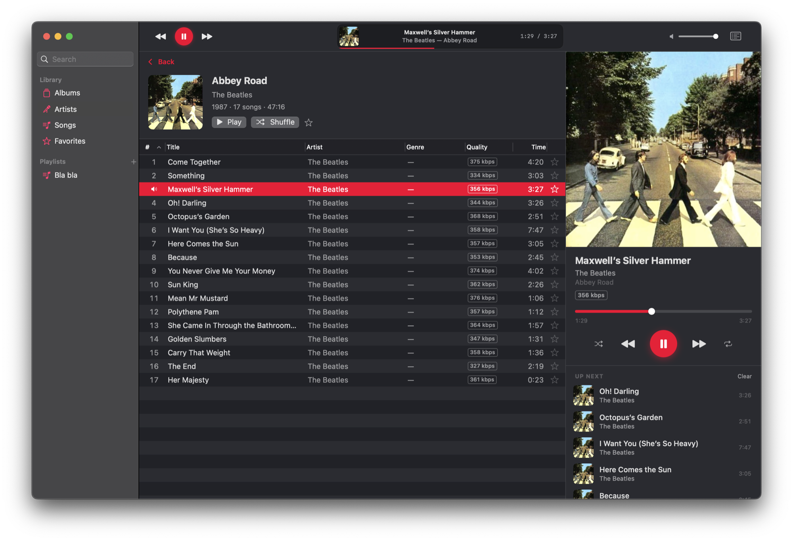

<div align="center">

# Sonicwave

**A native macOS music player for your own OpenSubsonic server.**

The interaction design iTunes got right — a dense sortable track list, a
column browser, Up Next, fast search — rebuilt as a modern, restrained
Mac app. Streaming-only, audiophile-grade playback, no Electron in sight.


**[Website](https://thijsw.github.io/sonicwave/)** · **[Latest release](https://github.com/thijsw/sonicwave/releases/latest)**



</div>

---

Sonicwave connects to a self-hosted [OpenSubsonic](https://opensubsonic.netlify.app/)
library ([Navidrome](https://www.navidrome.org/) is the reference server).
It's for people who run their own music server and want a real Mac app —
keyboard-friendly, low-footprint, native — instead of a browser tab.

## Download

Grab `Sonicwave-x.y.z.zip` from the
[latest release](https://github.com/thijsw/sonicwave/releases/latest), unzip,
and drop `Sonicwave.app` into `/Applications`. Builds are signed and
**notarized by Apple** — they launch without Gatekeeper warnings.

**First launch:** open **Settings → Connection** (⌘,), enter your server
address and credentials, hit **Test Connection** → **Save & Connect**.
Credentials go straight to the Keychain; your password never travels in a URL.
No server yet? Click **Use Demo Server** to try Sonicwave against the public
Navidrome demo.

## Highlights

**🎧 Serious about audio**
- **True gapless playback** — album transitions are seamless by construction.
- **Hardware sample-rate matching** (Audirvana/Roon-style, on by default):
  your DAC runs at each track's native rate, nothing gets resampled.
- **Streaming decode** of MP3, FLAC, AAC, WAV, AIFF and more — playback
  starts fast and memory stays flat.
- **Robust output routing**: pick any output device — AirPlay routes
  included — and unplugging or replugging a USB DAC mid-track recovers
  automatically. Your system-default device is never touched.

**📚 A library you can drive**
- A **Home page** to land on: Jump Back In, Keep Listening, Recently Added,
  Most Played, and a Random shelf with a re-roll button.
- Dense, sortable track table: double-click or ⏎ to play, ⌥-double-click to
  queue next, multi-select, drag to playlists.
- Column browser (Genre → Artist → Album), global search (⌘F), quality
  badges ("FLAC", "320 kbps") with lossless-first sorting.
- Server playlists round-trip fully: create, rename, reorder, delete.
- Favorites everywhere, with a ★ column.
- **Scrobbling** (on by default) feeds your server's play counts and
  Last.fm-style history; kick off a **server library scan** right from the
  app (File → Update Server Library).

**🖥 A proper Mac citizen**
- iTunes-style "LCD" in the toolbar; a resizable Now Playing panel with a
  reorderable Up Next queue; a menu-bar player that works with the window
  closed. Click the panel's artwork to Quick Look the cover at full
  resolution.
- Media keys, Control Center / Now Playing widget, live artwork.
- Light/Dark, full keyboard shortcuts, VoiceOver support, state restoration,
  sandboxed with a single entitlement (outgoing network).

## Requirements

- **macOS 15 Sequoia** or later
- An **OpenSubsonic-compatible server** (Navidrome, Gonic, LMS, Astiga, …)

## Status

v0.1.2 is out — feature-complete, with Mac App Store distribution in
progress. Deliberately out of scope for v1: offline downloads,
smart playlists, multi-server profiles, tag editing.

## For developers

Swift 6 (strict concurrency), SwiftUI with an AppKit core for the track
table, and **zero third-party dependencies**. Build with Xcode 26, or:

```sh
git clone https://github.com/thijsw/sonicwave.git && cd sonicwave
xcodebuild -project Sonicwave.xcodeproj -scheme Sonicwave \
  -destination 'platform=macOS' build   # or: test
```

The [`docs/`](docs/) directory holds the full design docs — architecture,
the playback-engine deep-dive (gapless + crackle forensics), API layer,
UI/UX rationale — and the running build log
([`docs/PROGRESS.md`](docs/PROGRESS.md)). The test suite runs hermetically —
in CI on every push ([`tests.yml`](.github/workflows/tests.yml)) — and an
opt-in live suite exercises a real server via `SONICWAVE_HOST/USER/PASS`
env vars. Releases ship through [`scripts/release.sh`](scripts/release.sh)
(archive → notarize → staple) and [`scripts/publish.sh`](scripts/publish.sh);
the [website](https://thijsw.github.io/sonicwave/) redeploys itself from
[`site/`](site/) on every release.

## License

[MIT](LICENSE)

---

<div align="center">
<sub>Built for people who miss iTunes 12.6 — the patterns, not the chrome.</sub>
</div>
